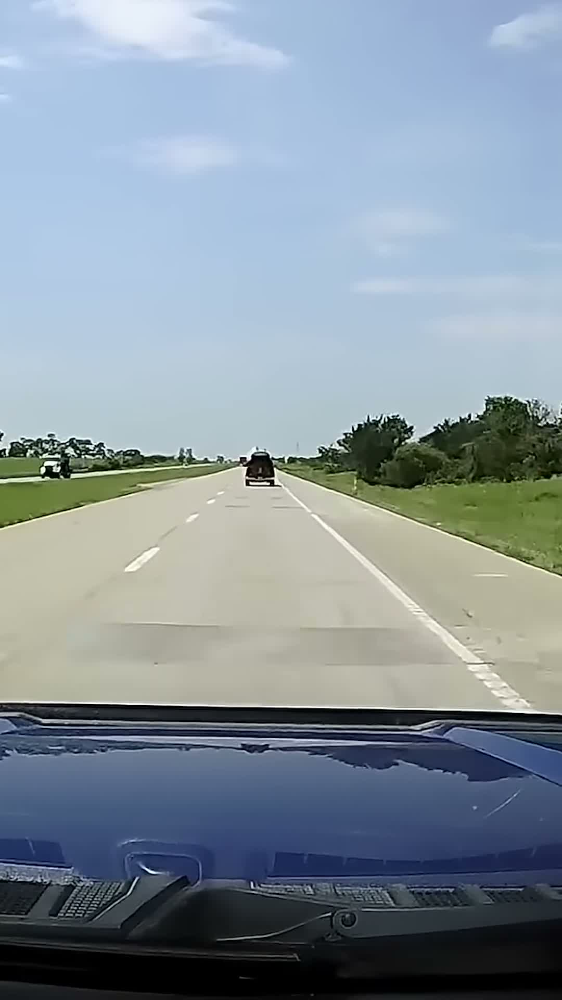
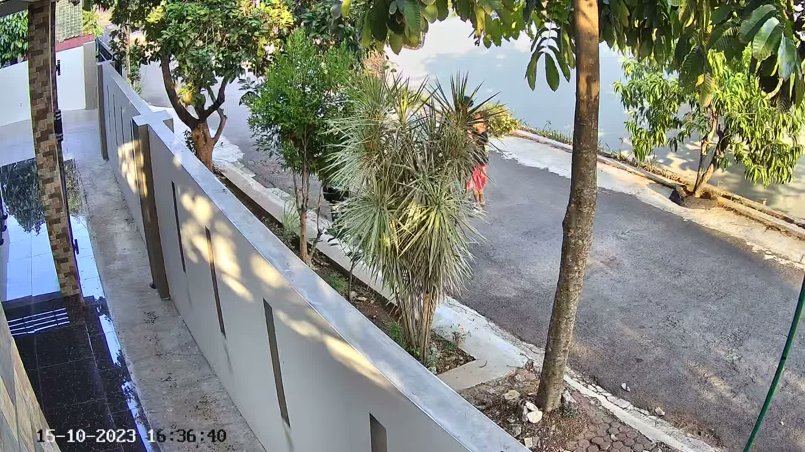
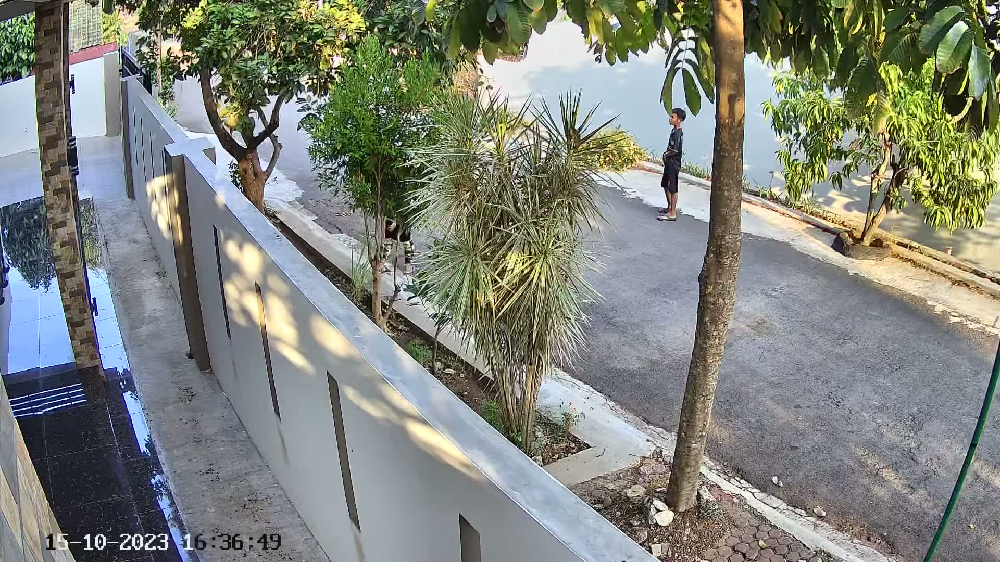
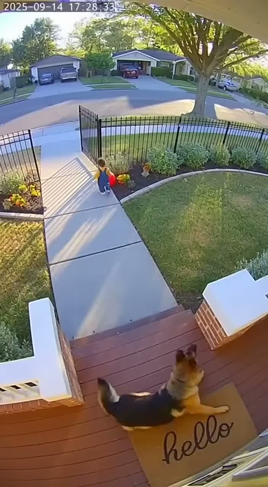
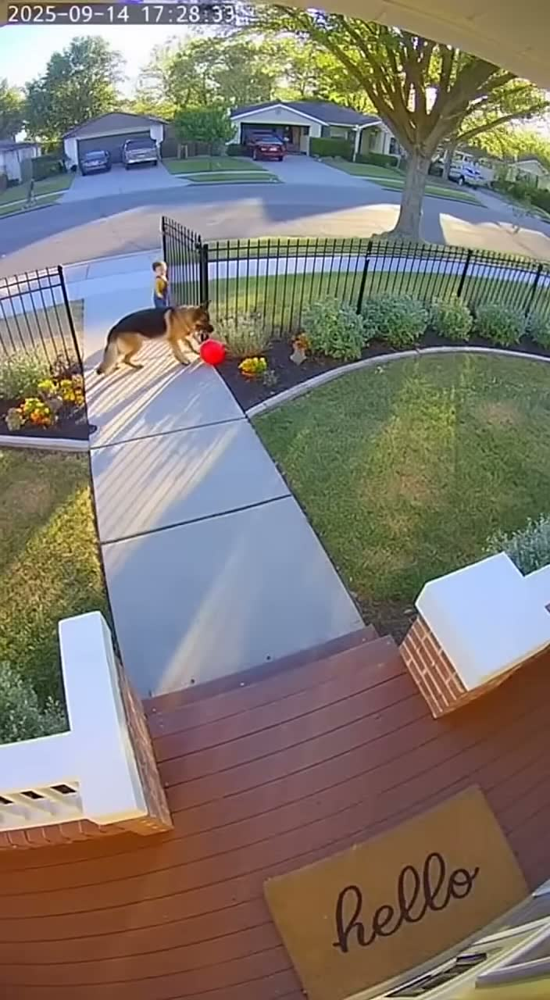

# sense-claude-multimodal

## Give Claude Ears: Multimodal Video Analysis

> Claude can see, but it can't hear. Cochl.Sense gives Claude ears.

The value of multimodal analysis is not about seeing what a human can already see — it's about enabling **automated, real-time judgment** that neither sound nor vision alone can reliably make.

A dog barking without context? Probably normal. A dog on camera? Also normal. But a dog barking **and** scratching at the front door for 30 minutes? That's separation anxiety — and you should know about it.

### How It Works

```
Video File (mp4)
  │
  ├── [Script] ffmpeg → Audio → Cochl.Sense API → Sound events (JSON)
  │                                                  (thud, tire squeal, siren, dog bark...)
  │
  ├── [Script] ffmpeg → Frames (JPG)
  │
  └── [Claude Code] Reads frames + sound analysis
                     → Combined situation assessment
                     → Severity level + recommended action
```

**Step 1** is automated via Python script. **Step 2** is done by Claude Code — no Anthropic API key needed, just your Claude Code subscription.

### Demos

Try with any video — the script handles extraction and sound analysis automatically. Here are three scenarios we tested:

#### Demo 1: Car Crash (Dashcam)

| Before (normal driving) | After (collision detected) |
|:-:|:-:|
|  |  |

| | Sound Only | Vision Only | **Sound + Vision** |
|---|-----------|-------------|-------------------|
| What we know | "Thud (98.9%) + Tire squeal (99%)" | "A car is sideways on the highway with debris" | **"Vehicle collision on highway at 11s — high-speed impact with road blockage, immediate danger of secondary collision"** |

Key sound events: `Thud` (0.989), `Tire_squeal` (0.990), `Alarm` (0.491)

#### Demo 2: Smart Home — Intrusion Detection (CCTV)

| Quiet (no activity) | Alert (person detected) |
|:-:|:-:|
|  |  |

| | Sound Only | Vision Only | **Sound + Vision** |
|---|-----------|-------------|-------------------|
| What we know | "Siren detected (~57%)" | "A person near a residential property" | **"Security alarm triggered while unidentified person near home — possible intrusion attempt"** |

Key sound events: `Siren` (0.570) at 15-22s, coinciding with unidentified person on camera

#### Demo 3: Smart Home — Pet Monitoring (Pet Cam)

| Watching (dog on porch) | Playing (normal activity) |
|:-:|:-:|
|  |  |

| | Sound Only | Vision Only | **Sound + Vision** |
|---|-----------|-------------|-------------------|
| What we know | "Dog barking (92.1%) + Female speech" | "Dog and child in front yard with a ball" | **"Dog barking excitedly during supervised play — normal activity, no alert needed"** |

Key sound events: `Dog_bark` (0.921), `Bird_chirp` (0.744), `Female_speech` (0.703)

> This demo shows the other side of multimodal value: **reducing false alarms**. A sound-only system would flag "dog barking" as a potential alert. Adding visual context confirms it's just playtime.

### Quick Start

#### Prerequisites

- Python 3.9+
- [ffmpeg](https://ffmpeg.org/) (`brew install ffmpeg` on macOS)
- [Cochl.Sense API key](https://dashboard.cochl.ai)
- [Claude Code](https://claude.ai/code) (for Vision analysis)

#### Setup

```bash
# 1. Clone
git clone https://github.com/meanmin/sense-claude-multimodal.git
cd sense-claude-multimodal

# 2. Setup Python environment
python3 -m venv venv
source venv/bin/activate
pip install -r requirements.txt

# 3. Configure API key
cp .env.example .env
# Edit .env and add your Cochl.Sense API key
```

#### Run

```bash
# Step 1: Extract audio/frames and analyze sound
python scripts/analyze_video.py samples/your_video.mp4 car_crash
python scripts/analyze_video.py samples/your_video.mp4 home_intrusion
python scripts/analyze_video.py samples/your_video.mp4 pet_monitoring

# Step 2: Open Claude Code and ask it to combine the results
# Example prompt:
# "Look at the frames in output/car_crash/frames/
#  and read the sound analysis in output/car_crash/sound_analysis.json.
#  Combine both to assess what happened in this scenario."
```

You can use any scenario name — the script creates a folder for each.

### Why Multimodal?

Cameras and microphones run 24/7, but humans can't monitor them 24/7.

| Approach | Limitation |
|----------|-----------|
| **Sound only** | "Dog barking" — playing? anxious? reacting to a stranger? |
| **Vision only** | "Dog at front door" — waiting for owner? needing to go out? |
| **Sound + Vision** | "Dog barking + pacing at door for 30 min = separation anxiety alert" |

The real power is not replacing human eyes — it's enabling **automated monitoring** that knows when to alert you, with context from both ears and eyes.

### Try Your Own Video

The script works with any video file. Just run:

```bash
python scripts/analyze_video.py path/to/your/video.mp4 your_scenario_name
```

Then ask Claude Code to analyze the results. Some ideas:
- **Dashcam footage** — traffic incidents, road hazards
- **Home security cam** — unusual activity detection
- **Pet cam** — behavior monitoring, separation anxiety
- **Baby monitor** — cry detection with visual context
- **Warehouse/factory** — equipment malfunction + visual confirmation

### Want Real-Time on Your Device?

This guide uses recorded files with the **Cochl.Sense Cloud API** — perfect for prototyping and proof of concept.

For **real-time edge deployment** on smart home devices, cameras, and IoT hardware, [contact Cochl](https://cochl.ai) to learn about the **Cochl.Sense Edge SDK**.

### Project Structure

```
sense-claude-multimodal/
├── scripts/
│   └── analyze_video.py          # Extracts audio/frames + Cochl.Sense analysis
├── samples/                       # Video files (not tracked in git)
├── output/
│   ├── car_crash/
│   │   ├── sound_analysis.json   # Cochl.Sense results
│   │   ├── frames/               # Extracted video frames
│   │   └── combined_judgment.md  # Final multimodal assessment
│   ├── home_intrusion/
│   │   ├── sound_analysis.json
│   │   ├── frames/
│   │   └── combined_judgment.md
│   └── pet_monitoring/
│       ├── sound_analysis.json
│       ├── frames/
│       └── combined_judgment.md
├── requirements.txt
├── .env.example
└── README.md
```

### Related Projects

- [sense-claude](https://github.com/meanmin/sense-claude) — Claude Code plugin for sound recognition
- [sense-claude-monitor](https://github.com/meanmin/sense-claude-monitor) — Health monitoring reports via Claude cowork
- [Cochl.Sense MCP Server Guide](https://medium.com/cochl/cochl-sense-mcp-server-user-guide-ac51044f6198) — MCP server integration
